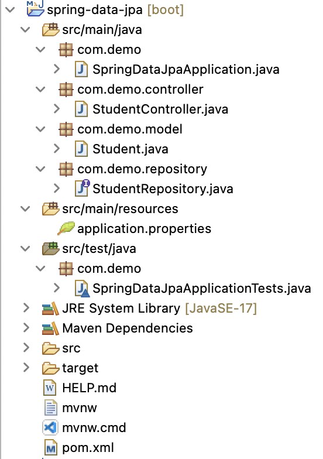
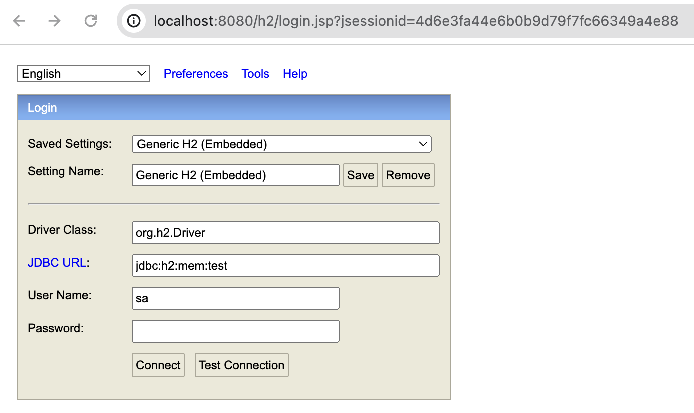
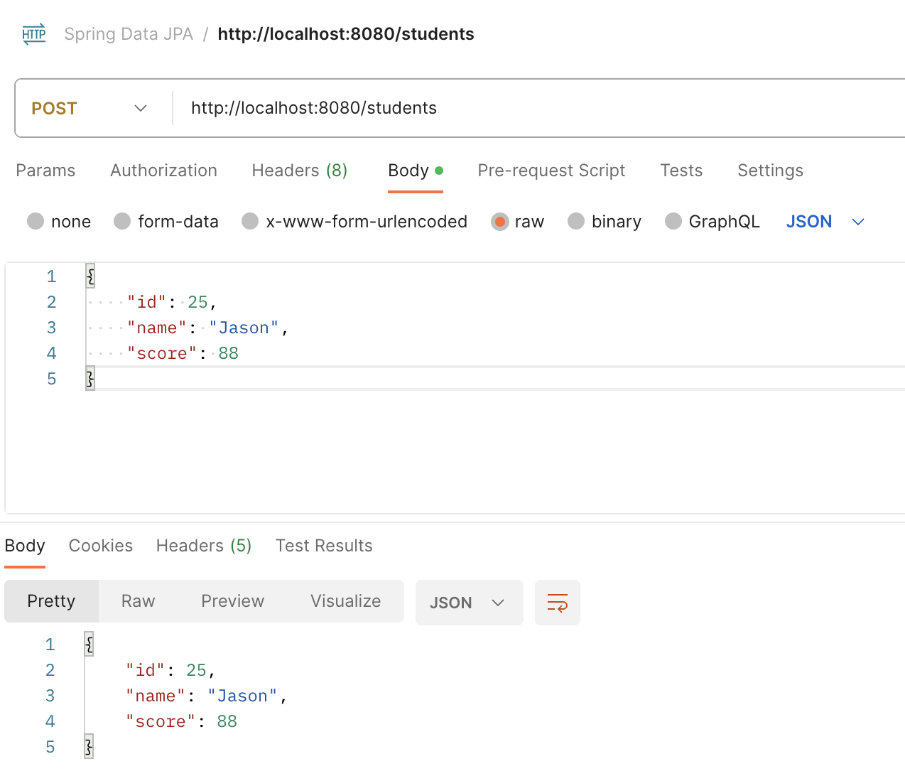
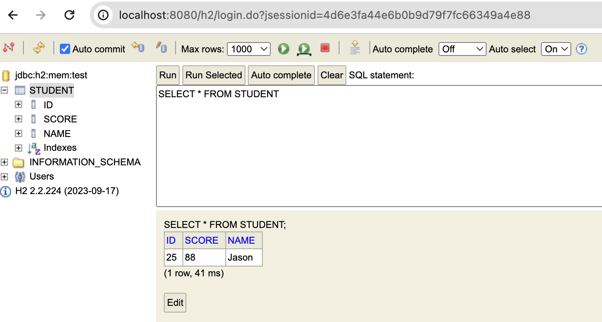

# spring-data-jpa

In this application, I built a `Spring Boot Rest APIs` using `Spring Data JPA` with `H2 Database`. The CRUD operations are made with Spring Data JPA’s `JpaRepository`. And the database will be `H2 Database` (in memory) by configuring project dependency & datasource.The application will be available at [http://localhost:8080](http://localhost:8080)

## Tools and Technologies Used
- Spring Boot 3.2.2
- JDK 17
- Spring Framework 6.1.3
- Maven 3.9
- Spring Tool Suite4 (STS)
- H2 Database 2.2
- Postman

## Project Structure

## API Endpoints
| Endpoint | Method | Description |
|---|---|---|
| /students | GET | Get all students. |
| /students | POST | Create a new student. |

## DEMO
- Access H2 Database

- Send POST request with POSTMAN

- Verify the data is added to the H2 Database
